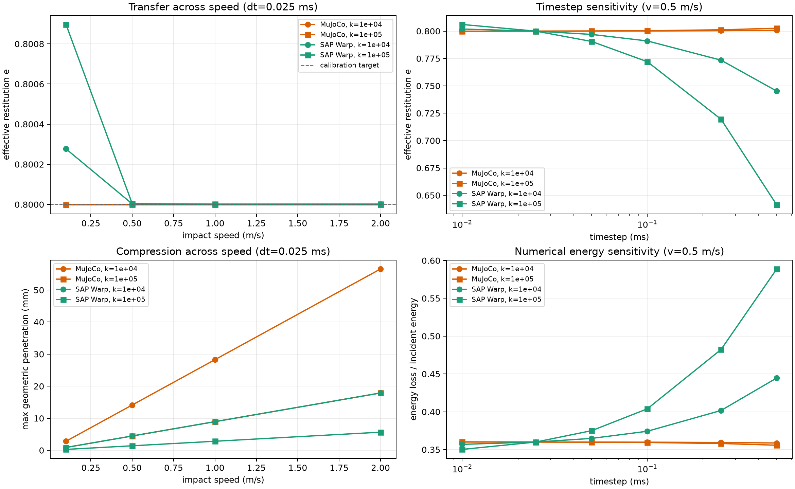
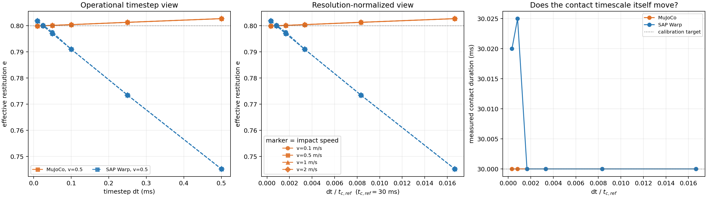

# Dynamic impact / restitution — SAP Warp vs MuJoCo

## Scope and status

This is a deliberately minimal dynamic-contact benchmark: a 1 kg sphere has one z translational DOF and impacts a plane. Gravity and friction are disabled; `margin=gap=0`, with a 1 mm initial geometric separation. Therefore every measured normal impulse must account for the momentum reversal, and there is no box-face contact manifold or gravitational energy to confound the result.

The sweep contains 96 transfer cases: two engines × two nominal stiffness regimes (`1e4`, `1e5` N/m) × six timesteps (0.01, 0.025, 0.05, 0.1, 0.25, 0.5 ms) × four incident speeds (0.1, 0.5, 1, 2 m/s).

## Calibration protocol

At `v_ref=0.5 m/s`, `dt_ref=0.025 ms`, each engine and each stiffness regime was independently tuned to `e_eff=0.8`; those native damping settings were then frozen for all 24 transfer cases in that engine/stiffness regime. This is behavior matching, not an assertion that MuJoCo's direct `solref` damping and SAP's pair `tau` have identical meanings.

| Engine | nominal k (N/m) | frozen native damping | measured calibration e | abs. error |
|---|---:|---|---:|---:|
| MuJoCo | 1e+04 | damping scale = 0.0743744 | 0.799998 | 2.22e-06 |
| MuJoCo | 1e+05 | damping scale = 0.0744141 | 0.799998 | 1.80e-06 |
| SAP Warp | 1e+04 | pair tau = 1.46094 ms | 0.800003 | 2.87e-06 |
| SAP Warp | 1e+05 | pair tau = 0.444116 ms | 0.800004 | 4.07e-06 |

MuJoCo uses `implicitfast` + Newton, a single explicit `condim=1` pair, constant `solimp=(0.9,0.9,...)`, and direct `solref`. SAP uses the `drake` preset; equal shape materials are assigned `ke_shape=2*k_pair` and `tau_shape=tau_pair/2`, so the actual combined pair values are the reported `k_pair`, `tau_pair`.

## Metrics and definitions

- `e_eff = -v_post/v_pre`, with velocities immediately before the first active normal impulse and immediately after it returns to zero.
- `delta_max`: largest geometric sphere–plane overlap (surface overlap); it is **not** a residual/margin proxy.
- `t_c`: duration of the nonzero normal-impulse episode.
- `F_n,max` and `J=sum(F_n dt)`: peak force and normal impulse.
- consistency check: `J` versus `m(v_post-v_pre)`.
- `E_loss/E_in = 1-e_eff^2`. The table reports the largest impulse consistency error over all 24 transfer cases in a regime.

## Compact results

| Engine | nominal k | e at reference | e span across v (ref dt) | e range across dt (ref v) | t_c at reference (ms) | largest delta (mm) | max impulse error | mean wall / case (ms) |
|---|---:|---:|---:|---:|---:|---:|---:|---:|
| MuJoCo | 1e+04 | 0.8 | 1.998e-15 | 0.8–0.8008 | 99.6 | 56.6 | 2.5e-15 | 14 |
| MuJoCo | 1e+05 | 0.8 | 4.441e-16 | 0.7999–0.8026 | 31.5 | 17.9 | 1.7e-15 | 4.49 |
| SAP Warp | 1e+04 | 0.8 | 0.0002768 | 0.7452–0.8019 | 30 | 17.9 | 1e-06 | 3.65e+03 |
| SAP Warp | 1e+05 | 0.8 | 0.0008948 | 0.6412–0.8061 | 9.5 | 5.68 | 4.3e-07 | 1.34e+03 |

## What this sweep establishes

1. **The reference behavior is genuinely matched.** Every engine/regime reaches `e=0.8` at the reference impact to within `4.1e-6`; both also preserve restitution across the four incident speeds at the reference timestep (largest span: SAP `8.95e-4`, MuJoCo numerical roundoff).
2. **The timestep transfer differs substantially in the present native settings.** At 0.5 ms and 0.5 m/s, MuJoCo remains at `e=0.8008` (`k=1e4`) and `0.8026` (`k=1e5`), whereas SAP declines to `0.7452` and `0.6412`. The corresponding SAP loss fractions increase because `E_loss/E_in=1-e^2`.
3. **The equal nominal k labels do not give equal dynamic contact duration.** At the calibrated reference impact, SAP has `t_c=30.0/9.5 ms` for `k=1e4/1e5`; MuJoCo has `99.6/31.5 ms`. Its reference geometric compression is likewise `14.14/4.47 mm`, versus SAP's `4.47/1.41 mm`. This is approximately a factor 3.16 in duration/compression scaling and is a direct reminder that the prior scalar static mapping does not make these two native formulations dynamically stiffness-identical.
4. **The telemetry is internally consistent.** MuJoCo's normal impulse agrees with momentum change to machine precision; SAP's maximum relative discrepancy is `1.0e-6` (its Warp arithmetic/telemetry precision). Thus the SAP restitution decline at larger timestep is not a missing-force accounting artifact.

## Interpretation boundaries

1. This test has an exact **bookkeeping** ground truth (normal impulse must equal momentum change, and energy loss follows `1-e^2`) but it does not prescribe a unique physical restitution law. The matched target is a deliberately chosen behavior, `e=0.8`.
2. The labels `k=1e4/1e5 N/m` are nominal target regimes, not dynamically matched stiffnesses. SAP's `k_pair` is a direct pair-material parameter; MuJoCo's direct `solref` stiffness is an acceleration-level constraint parameter. The measured contact-duration/compression mismatch above demonstrates that a static scalar mapping alone is insufficient for a dynamic stiffness match.
3. Therefore the strongest current conclusion is about **each engine's restitution transfer after one e-calibration**. To make a stronger engine-vs-engine timestep claim, the next controlled variant should additionally calibrate each engine's reference `t_c` (or `delta_max`) to the same value, then repeat the dt sweep. A comparison of an individual native damping number would not be meaningful.
4. SAP broad-phase candidates can persist during separation. Its contact duration and impulse here use `gamma_n/dt > 1e-10 N`, rather than raw candidate count; otherwise the duration would be artificially inflated by zero-force candidates.

## Reproducibility

- MuJoCo runner: `mujoco-sim/learn_mujoco/impact_experiments/run_sphere_plane_impact.py`
- SAP runner: `sap-sim/scripts/run_sphere_plane_impact.py`
- This renderer: `scripts/summarize_dynamic_impact_restitution.py`
- Raw summary data and one complete trace per case: `exp-results/dynamic-impact-restitution/`

---

## Extension: equal restitution **and** equal dynamic contact timescale

### Why this extension is needed

The nominal-stiffness sweep above deliberately showed a limitation: at the
reference impact, the two engines had very different contact durations. A
comparison at the same absolute timestep can then conflate two causes:

1. one contact model is intrinsically faster, hence receives fewer steps per
   collision; and
2. one numerical/contact formulation is more timestep sensitive.

This extension removes the first confound. At the same reference point
`v_ref=0.5 m/s`, `dt_ref=0.025 ms`, each engine is jointly calibrated to

\[
e_{\mathrm{eff}}=0.8, \qquad t_c=30\ \mathrm{ms}.
\]

The calibrated native parameters are frozen, then the same 24 transfer cases
(four incident speeds x six timesteps) are run. This is again behavior
matching, not an assertion that the resulting internal stiffness parameters
have the same physical meaning.

| engine | frozen native stiffness regime | frozen damping regime | reference \(e\) | reference \(t_c\) |
|---|---|---|---:|---:|
| MuJoCo | nominal target \(1.10276\times10^5\) N/m; direct `solref` stiffness \(11027.6\ \mathrm{s}^{-2}\) | damping scale `0.0744171` | 0.799997 | 30.000 ms |
| SAP Warp | pair \(k_e=1.0\times10^4\) N/m; shape \(k_e=2.0\times10^4\) N/m | pair `tau=1.46094 ms`; shape `tau=0.730469 ms` | 0.800003 | 30.025 ms |

The SAP local search checked pair \(k_e=7.5,8.5,10.0,11.5,13.0\times10^3\)
N/m after independently matching \(e=0.8\); their resulting contact durations
were 34.675, 32.575, **30.025**, 28.000 and 26.325 ms. Thus \(10^4\) N/m is
the measured closest 30-ms SAP regime, not an assumed parameter correspondence.

### Results: absolute timestep and normalized resolution

For the main restitution comparison, the relevant normalized resolution is

\[
\frac{dt}{t_{c,\mathrm{ref}}}, \qquad t_{c,\mathrm{ref}}=30\ \mathrm{ms}.
\]

It represents the inverse of the nominal number of timesteps resolving one
reference collision. The largest timestep here is therefore
\(0.5/30=0.01667\), or roughly 60 steps per collision; it is not an
under-resolved one- or two-step impact.

| \(dt\) (ms) | \(dt/t_{c,ref}\) | MuJoCo \(e\), \(v=0.5\) | SAP \(e\), \(v=0.5\) | MuJoCo / SAP measured \(t_c\) (ms) |
|---:|---:|---:|---:|---:|
| .010 | .000333 | .799914 | .801919 | 30.000 / 30.020 |
| .025 | .000833 | .799997 | .800003 | 30.000 / 30.025 |
| .050 | .001667 | .800140 | .797005 | 30.000 / 30.000 |
| .100 | .003333 | .800427 | .791056 | 30.000 / 30.000 |
| .250 | .008333 | .801304 | .773499 | 30.000 / 30.000 |
| .500 | .016667 | .802717 | .745222 | 30.000 / 30.000 |

At the reference timestep, both engines also transfer across impact speed:
MuJoCo gives \(e=0.799997\) for 0.1, 0.5, 1 and 2 m/s; SAP gives
\(0.800277, 0.800003, 0.800000, 0.800001\), respectively. Therefore the
observed difference is a timestep-transfer effect, not an impact-speed effect
in this linear single-contact setup.

### What the time-matched experiment establishes

1. **The earlier duration mismatch is no longer an explanation.** Both
   reference contacts last 30 ms, and both keep an approximately 30-ms measured
   impulse episode throughout this dt sweep.
2. **At an equal 30-ms dynamic timescale, MuJoCo is materially more stable in
   restitution versus timestep for these native settings.** From
   \(dt/t_c=0.000333\) to 0.016667, MuJoCo changes by about +0.0028 in
   restitution; SAP falls by about -0.0567. At the largest timestep, SAP loses
   \(1-0.7452^2=44.5\%\) of incident kinetic energy, versus MuJoCo's
   \(1-0.8027^2=35.6\%\).
3. This remains a **native-model, calibrated behavior comparison**, not a
   universal proof that one engine is always more accurate. It covers one
   frictionless scalar sphere--plane contact, the SAP `drake` preset, and
   MuJoCo `implicitfast` + Newton. It is nevertheless stronger than the
   nominal-\(k\) result because contact timescale has been controlled.

### Extension data and scripts

- data: `exp-results/dynamic-impact-restitution-time-matched/`
- joint calibration support: `mujoco-sim/learn_mujoco/impact_experiments/run_sphere_plane_impact.py` and `sap-sim/scripts/run_sphere_plane_impact.py` (`--target-contact-ms 30`)
- renderer: `scripts/summarize_dynamic_impact_time_matched.py`
