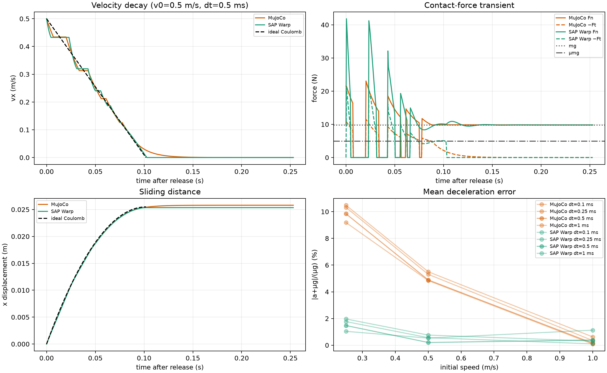

# Kinetic friction — free sliding block, SAP Warp vs MuJoCo

## Task

A 1 kg, 40 mm cube sits on a horizontal plane with rotation and y translation structurally locked. Gravity is enabled, `mu=0.5`, and `margin=gap=0`. Before every release, the system settles for 1 s with no horizontal force. At release, the block is assigned `v_x(0)=v0`; no horizontal force is ever applied afterward.

The analytic Coulomb reference during sliding is

\[
F_t=-\mu mg,\quad a_x=-\mu g=-4.905\;\mathrm{m/s^2},\quad
t_{stop}=v_0/(\mu g),\quad x_{stop}=v_0^2/(2\mu g).
\]

Sweep: `v0 = 0.25, 0.5, 1.0 m/s`; `dt = 0.1, 0.25, 0.5, 1 ms`; nominal pair normal stiffness `k_pair=1e4 N/m`. SAP uses `drake`, pair `tau=3 ms`; MuJoCo uses the prior matched-normal baseline (`implicitfast`, Newton, elliptic cone, no NoSlip).

## Normal-contact gate

All 24 cases passed the pre-release normal gate: True. The gate requires contact duty ≥99.9%, normal-force relative error ≤1%, coefficient of variation ≤1%, and vertical RMS speed ≤0.1 mm/s. Both engines have four active box-plane contact points in this stage and mean `Fn≈9.81 N`.

This gate validates the initial condition only. It deliberately does **not** assume that normal force remains `mg` after a tangential velocity is imposed; that is a measured outcome below.

## Metrics

- `a_mean`: mean numerical acceleration while `0.05v0 < vx` and `t≤t_stop`.
- `x at t_stop`: position at the analytical stopping time; this avoids confusing residual post-stop creep with kinetic sliding accuracy.
- `t near stop`: first time `vx≤0.01v0`; it is intentionally reported separately because it is sensitive to the engine's stick transition.
- `Fn moving` and `|Ft|/(mu Fn)` are directly measured contact telemetry during that same moving interval.

## Reference timestep (0.5 ms)

| Engine | v0 (m/s) | mean a (m/s²) | decel. error | x-stop error | near-stop-time error | mean Fn while moving (N) | mean |Ft|/(μFn) |
|---|---:|---:|---:|---:|---:|---:|---:|
| MuJoCo | 0.25 | -4.42 | 9.84% | 0.56% | 66.77% | 11.3 | 0.889 |
| MuJoCo | 0.5 | -4.67 | 4.89% | 0.25% | 23.61% | 13.8 | 0.933 |
| MuJoCo | 1 | -4.9 | 0.15% | 0.21% | 6.93% | 19.3 | 0.993 |
| SAP Warp | 0.25 | -4.83 | 1.47% | 1.21% | 2.02% | 11.7 | 0.988 |
| SAP Warp | 0.5 | -4.9 | 0.20% | 0.54% | 0.06% | 16 | 0.992 |
| SAP Warp | 1 | -4.92 | 0.39% | 0.26% | 0.43% | 25.6 | 0.993 |

## Interpretation

1. The task has a clean analytical target only while the normal load remains `mg`. Both simulations begin in a stable normal equilibrium, but assigning a horizontal velocity induces a short normal-force transient. The force panel exposes that coupling instead of hiding it by assuming `Fn=mg`.
2. Therefore a deviation from `a=-mu g` can arise through either tangential regularization or induced normal-load dynamics. The paired `Fn` and `|Ft|/(mu Fn)` telemetry distinguishes those mechanisms.
3. `t_near_stop` is not a primary kinetic-friction accuracy metric: near zero speed the engines transition into their static/regularized friction behavior, which was separately studied in the force-hold experiment. The primary comparison is velocity/position error up to analytical `t_stop`.
4. This is a matched-normal-compliance baseline, not a claim of engine-native-best friction. A later native-best MuJoCo/NoSlip or SAP tau/preset study should be reported separately.

## Reproducibility

- MuJoCo runner: `mujoco-sim/learn_mujoco/friction_experiments/run_free_sliding_block.py`
- SAP runner: `sap-sim/scripts/run_free_sliding_block.py`
- Renderer: `scripts/summarize_kinetic_friction.py`
- Raw traces and JSON/CSV: `exp-results/kinetic-friction/`
