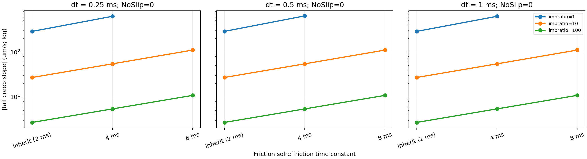
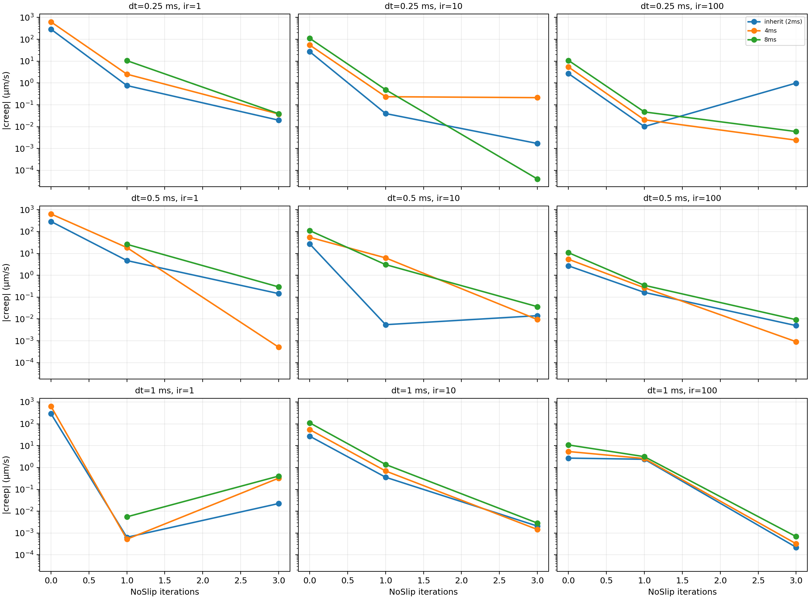

# MuJoCo anti-slip ablation：固定 normal contact 的 4 N sub-Coulomb hold

## 结论先行

这是针对三层 box benchmark 的小型、受控 MuJoCo friction ablation。固定 `F=4 N < mu*N = 4.905 N`、几何、`mu=0.5` 与 normal contact，只改变 friction-specific solver controls。

最清楚的结论出现在 **NoSlip=0** 的原生 soft-friction model：

1. `impratio` 是主导项。对 inherited `solreffriction`，creep 从 `289.7` (`ir=1`) 降到 `27.14` (`ir=10`) 再到 `2.698 µm/s` (`ir=100`)；每提高 10 倍约降低 10 倍。
2. `solreffriction` 的 time constant 越长，切向 regularization 越软、creep 越大。例如 `ir=100` 下，2 ms inherited / 4 ms / 8 ms 分别为 `2.698 / 5.399 / 10.812 µm/s`。
3. 在固定 normal contact 后，`dt=0.25, 0.5, 1 ms` 对 NoSlip=0 的 steady creep 几乎没有可分辨影响；这支持它主要是 **soft-friction regularization** 效应，而非此范围内的 timestep-discretization error。
4. NoSlip=1/3 通常将 creep 压到 `0.00004–10 µm/s` 的极小数值区，但它不是严格单调的 knob：在不同 `dt`、`impratio` 和 `solreffriction` 下可能反向或变差。因此应把 NoSlip 视为 anti-drift post-process，而不是用“iteration 越大越物理正确”解释。

## 1. 固定场景和控制变量

| 项目 | 固定设定 |
|---|---:|
| 场景 | 3 个 40 mm cube 竖直堆叠，均为 1 kg |
| 外力 | top box x 方向：1.5 s settle，1 s ramp 到 4 N，hold 8 s |
| 摩擦 | `mu=0.5`；middle–top 静摩擦上限 `0.5×9.81=4.905 N` |
| Integrator / solver | `implicitfast` / Newton，100 iterations，tolerance `1e-12` |
| Cone | elliptic |
| Normal solver reference | `solref=(2 ms, 1)`，`solimp=(0.9,0.95,0.001,0.5,2)` |
| Margin / gap | 0 / 0 |
| Timestep | 0.25、0.5、1 ms |

normal `timeconst=2 ms` 对三个 timestep 都满足 MuJoCo 的 `timeconst >= 2*dt` refsafe 条件，故不会被内部 clamp；这就是“normal compliance 固定”的含义。

接触通过 explicit pair 给定。pair 的 five-entry friction 明确设为：

```xml
friction="0.5 0.5 0.005 0.0001 0.0001"
```

前两项分别是两个切向方向，不能误写成 geom 的三项格式 `0.5 0.005 0.0001`；后者会造成非预期的 0.005 横向摩擦。

## 2. 实际 sweep

共 `3 × 3 × 3 × 3 = 81` 个 10.5 s simulation runs：

- `solreffriction`: inherit normal `solref`（`0 0`，实际等价 2 ms）、4 ms、8 ms；
- `impratio`: 1、10、100；
- `noslip_iterations`: 0、1、3；
- `dt`: 0.25、0.5、1 ms。

仅在 elliptic cone 下 `solreffriction` 对 contact friction dimension 生效。由于 friction residual 恒为零，正格式下只有其第一个 `timeconst` 有效，damping ratio 不参与；这正是这里选择 time constant、而非把它误称为独立弹簧刚度的原因。参见 [MuJoCo XML reference：contact pair `solreffriction`](https://mujoco.readthedocs.io/en/latest/XMLreference.html)。

主要 metric 是 tail window `t∈[8.5,10.5] s` 上 middle–top relative displacement 的 OLS slope：

$$
v_{\mathrm{creep}}=\mathrm{slope}_{\mathrm{OLS}}(x_{\mathrm{rel}}(t)).
$$

同时记录 `v_t`、`Fn`、`Ft`、`rho=Ft/(mu Fn)`、contact duty、contact count、gap、vertical RMS velocity、solver iterations。只有 tail contact duty 至少 99% 的 case 才把该 slope 解释成 steady creep。

## 3. Normal / force-balance gate

81 个 case 中 78 个通过。通过案例的 middle–top tail telemetry 范围为：

| Metric | 78 个通过案例的范围 | 期望 |
|---|---:|---:|
| Contact duty | 100% | 100% |
| Mean `Fn` | 9.7987–9.8184 N | 9.810 N |
| `Fn` balance error | -0.116%–+0.086% | 0% |
| Mean `rho` | 0.8127–0.8175 | `4/(0.5×9.81)=0.8155` |
| Max body `vz,RMS` | ≤0.0714 mm/s | 接近 0 |

未通过的三个案例均为 `solreffriction=8 ms, impratio=1, NoSlip=0`，在 hold 的 `6.74–7.285 s` 丢失 top contact。它们是 tangential regularization 过软导致的真实 failure，图中不把其 free-flight tail slope 画成“低 creep”。

## 4. 最干净的子实验：NoSlip=0

下表为 `|v_creep|`（µm/s）。三列是不同 `dt`；破折号为 tail contact loss。

| Friction time constant | `impratio` | 0.25 ms | 0.5 ms | 1 ms |
|---|---:|---:|---:|---:|
| inherit (2 ms) | 1 | 289.702 | 289.745 | 289.747 |
| inherit (2 ms) | 10 | 27.143 | 27.143 | 27.143 |
| inherit (2 ms) | 100 | 2.698 | 2.698 | 2.698 |
| 4 ms | 1 | 627.761 | 641.343 | 627.800 |
| 4 ms | 10 | 54.661 | 54.661 | 54.662 |
| 4 ms | 100 | 5.399 | 5.399 | 5.407 |
| 8 ms | 1 | — | — | — |
| 8 ms | 10 | 110.870 | 110.870 | 110.870 |
| 8 ms | 100 | 10.812 | 10.812 | 10.826 |



这张图给出最可泛化的机制：在 normal force、`rho`、contact duty 保持不变时，增大 `impratio` 直接提高 friction dimensions 相对 normal dimension 的 enforcement；而增大 friction time constant 会削弱 tangential damping，因而提高 steady slip rate。MuJoCo 官方也明确说明 soft elliptic friction 不保证严格零速 sticking，推荐 elliptic cone、较大 `impratio` 和小 Newton tolerance 抑制 slow slip。[MuJoCo Modeling：slow slippage](https://mujoco.readthedocs.io/en/latest/modeling.html)

## 5. NoSlip interaction：并非单调参数



NoSlip=1 或 3 大多将残余 creep 再压低几个数量级。几个有代表性的稳定案例：

| `dt` | `solreffriction` | `impratio` | NoSlip | `|v_creep|` | tail `Fn` | tail `rho` | duty |
|---:|---:|---:|---:|---:|---:|---:|---:|
| 0.25 ms | inherit | 100 | 0 | 2.698 µm/s | 9.809 N | 0.8156 | 100% |
| 0.25 ms | inherit | 100 | 1 | 0.0102 µm/s | 9.809 N | 0.8156 | 100% |
| 1 ms | inherit | 100 | 3 | 0.000224 µm/s | 9.809 N | 0.8156 | 100% |
| 0.25 ms | 8 ms | 10 | 3 | 0.0000404 µm/s | 9.809 N | 0.8156 | 100% |
| 0.5 ms | 4 ms | 1 | 3 | 0.000510 µm/s | 9.809 N | 0.8156 | 100% |

但 NoSlip residual 不严格随 iteration 下降：例如 `dt=0.25 ms, ir=100, inherit` 是 `2.698 → 0.0102 → 0.992 µm/s`（NoSlip 0→1→3）。这是低残余区的 solver/contact-manifold interaction，而不是改变 Coulomb load；其 `Fn` 和 `rho` 仍正常。故应报告具体配置和 telemetry，不能只写“开 NoSlip=3 一定最好”。

这也符合官方的定位：NoSlip 是主 solver 之后、只更新 friction force 且忽略 friction regularization 的 modified-PGS post-process；它通常能 suppress drift，但不再求解一个明确的优化问题，在复杂 contact interactions 中可能不稳定。[MuJoCo Modeling：NoSlip caveats](https://mujoco.readthedocs.io/en/latest/modeling.html)

## 6. 对原 SAP–MuJoCo 比较的影响

先前的 matched-compliance comparison 仍然有效：它比较的是两套特定 contact formulation 的行为。这个 ablation 新增的是：

> “MuJoCo friction 会 creep” 不是 engine-level 定论；在固定物理载荷下，残余 creep 是 `solreffriction`、`impratio`、NoSlip、contact manifold 和 solver settings 的函数。

对于需要尽量抑制 sub-Coulomb drift 的控制/数据生成任务，优先路径是：elliptic + Newton + small tolerance → 增大 `impratio` → 若允许 NoSlip 的建模取舍，再开启少量 NoSlip iterations。对于需要可解释 compliant contact 或 inverse dynamics 的任务，则应保留 NoSlip=0，并明确报告 `impratio` 与 friction reference。

## 7. Reproducibility

- Runtime（CPU，MuJoCo 3.12.0）：81 cases 合计 84.80 s；单 case 平均 1.047 s。按 timestep 的平均 wall time 为 0.25 / 0.5 / 1 ms：`1.614 / 0.916 / 0.611 s`。NoSlip iterations 会增加每步的 post-processing 成本，因此这些数同时依赖 `dt` 和 NoSlip。
- Runner: `mujoco-sim/learn_mujoco/stacking_experiments/run_frictional_stack_anti_slip_ablation.py`
- Summarizer / plots: `scripts/summarize_mujoco_anti_slip_ablation.py`
- 81 个 trace、model XML、metadata：`exp-results/frictional-stack-v3/mujoco-anti-slip-ablation-v3/`
- Machine-readable metrics: `exp-results/frictional-stack-v3/mujoco-anti-slip-ablation-v3/summary.json` 与 `top-interface-summary.csv`
