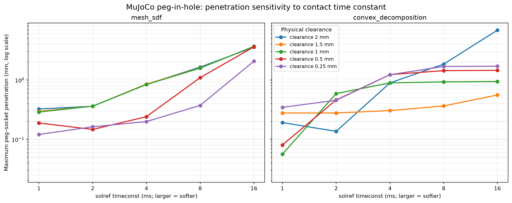
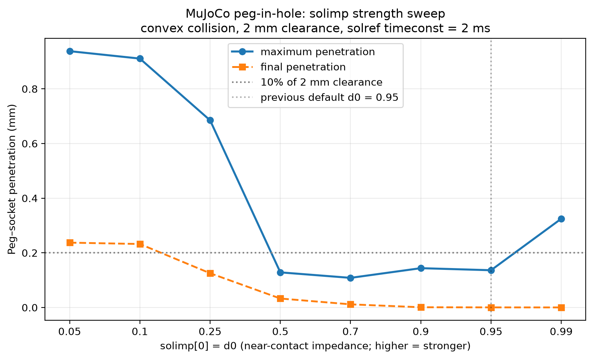
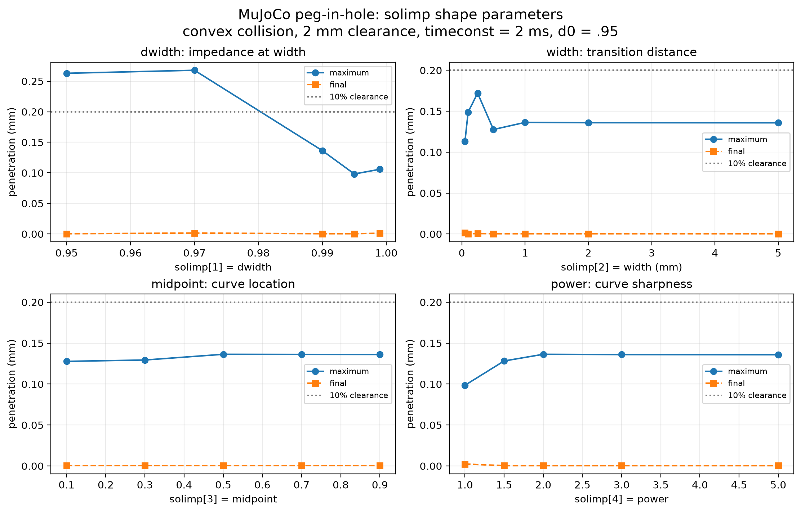
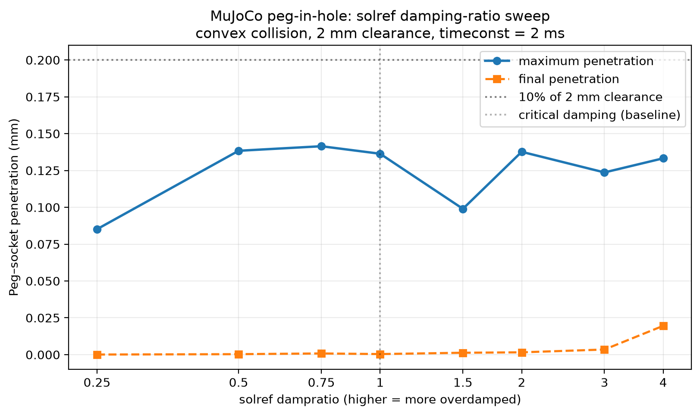
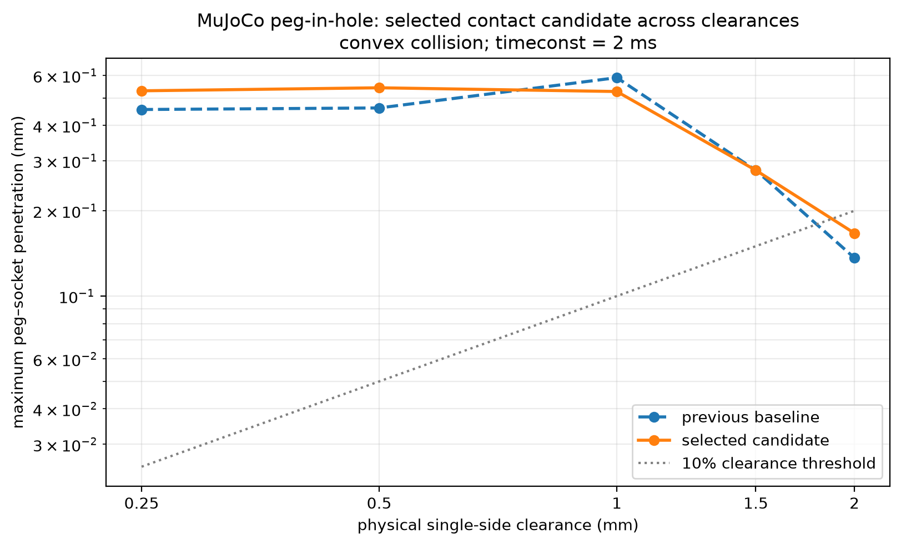

# MuJoCo peg-in-hole：接触参数敏感性报告

## 结论

在这个偏心、带 1° 初始倾角的插入任务中，最影响穿透的接触参数是 `solref` 的 `timeconst`，其次是 `solimp` 的 `d0` 和 `dwidth`。在当前条件下，`solimp` 的曲线形状参数 `width`、`midpoint`、`power` 只带来很小变化。

“更硬”并不保证更可信：`d0=0.99` 的峰值穿透反而是 `0.325 mm`，比默认 `d0=0.95` 的 `0.136 mm` 大。这是接触瞬态、几何切换及有限步长共同决定的数值结果，不可将单个参数当作物理材料常数。

> 重要修订：下文的“10% 间隙”仅是用于筛掉明显依赖穿模结果的**任务自定义筛选线**，不是 MuJoCo、peg-in-hole 文献或机械设计的通用“可信”标准。所有连续 penetration 数值均应保留并比较，不能只以通过/不通过作为精度结论。

## 固定任务与判据

| 项目 | 设定 |
|---|---|
| 碰撞表示 | CoACD convex decomposition socket（32 个 convex pieces） |
| Peg / socket 半径 | 10 mm / 12 mm |
| 单侧物理间隙 | 2 mm |
| 初始条件 | 横向偏移 1 mm、倾角 1°、自由落体插入 |
| 仿真长度 / dt | 2 s / 0.5 ms |
| 积分器 / 摩擦锥 | `implicitfast` / `elliptic` |
| 摩擦 | `0.8 0.005 0.0001` |
| 基准接触 | `solref="0.002 1"`；`solimp="0.95 0.99 0.001 0.5 2"` |
| 筛选线（非通用标准） | 成功进入腔体、最终中心偏移 ≤ 2 mm，且最大与最终 peg–socket penetration 均 ≤ 0.2 mm（间隙的 10%） |

### 为什么曾使用 10% 间隙？它有什么依据？

该值最初是一个保守的**相对尺度启发式**：若数值接触重叠已达到真实单侧间隙的十分之一，插入是否成功就可能主要由 penalty-like 接触柔顺性，而非真实几何容差决定。它有助于快速标记例如 0.25 mm 间隙下 0.45 mm 的结果，但没有普适物理含义。

MuJoCo 官方只定义：接触距离为负表示几何体重叠，接触力由 `margin`、`solref` 和 `solimp` 的模型产生；文档没有给出“penetration 必须小于间隙某百分比”的推荐阈值。[MuJoCo computation documentation](https://github.com/google-deepmind/mujoco/blob/main/doc/computation/index.rst) [MuJoCo modeling documentation](https://mujoco.readthedocs.io/en/stable/modeling.html)

更严谨的标准应按用途定义：

- **有实物或 CAD tolerance**：让峰值数值 penetration 小于分配给仿真的几何/装配误差预算，并同时比较插入力、接触力矩、最终 pose 和成功边界；
- **有解析解或实验轨迹**：以解析/实测的位移、力、能量或 rebound 为主误差，而非阈值本身；
- **没有 ground truth 的 simulator 对照**：报告无量纲比 `p_max / clearance`，并做 `dt`、solver tolerance、碰撞表示的收敛/敏感性检查。只有该比值在这些变化下稳定且远小于 1，才能说结果对数值设定较稳健。

因此，本文之后的 ✓/✗ 应读作“通过/未通过本实验筛选线”，而不是“物理可信/不可信”的最终判决。

## 1. `solref timeconst`：主导穿透

这里固定默认 `solimp=(0.95, 0.99, 0.001, 0.5, 2)`。正格式 `solref=(timeconst, dampratio)` 中，较大的 `timeconst` 表示较软、响应更慢的接触。

代表性的 convex、2 mm 间隙行如下：

| timeconst (ms) | 最大穿透 (mm) | 最终穿透 (mm) | 可信 |
|---:|---:|---:|:---:|
| 1 | 0.1918 | 0.0004 | ✓ |
| 2 | **0.1364** | 0.0004 | ✓ |
| 4 | 0.8916 | 0.0016 | ✗ |
| 8 | 1.8480 | 0.0064 | ✗ |
| 16 | 6.9058 | 0.0508 | ✗ |

因此，`1–2 ms` 是这个任务当前测试范围内合理的快速接触区间；`4 ms` 之后的峰值穿透已明显大于 10% 间隙。

## 2. `solimp[0]=d0`：零距离接触阻抗

`d0` 是接触距离为零时的无量纲约束阻抗，越高通常代表更强的近接触约束。它不是杨氏模量或可跨任务直接迁移的“材料硬度”。此扫描保持 `dwidth=.99`、`width=1 mm`、`midpoint=.5`、`power=2`。

| d0 | 最大穿透 (mm) | 最终穿透 (mm) | 可信 |
|---:|---:|---:|:---:|
| 0.05 | 0.93788 | 0.23728 | ✗ |
| 0.10 | 0.91076 | 0.23232 | ✗ |
| 0.25 | 0.68492 | 0.12533 | ✗ |
| 0.50 | 0.12854 | 0.03284 | ✓ |
| 0.70 | **0.10845** | 0.01155 | ✓ |
| 0.90 | 0.14386 | 0.00087 | ✓ |
| 0.95（基准） | 0.13636 | 0.00039 | ✓ |
| 0.99 | 0.32471 | 0.00022 | ✗ |

## 3. `solimp[1:5]`：阻抗曲线形状

`solimp=(d0, dwidth, width, midpoint, power)`：

- `dwidth`：penetration 达到 `width` 时的阻抗；
- `width`：阻抗从 `d0` 过渡至 `dwidth` 的距离尺度；
- `midpoint`：该曲线的归一化中点；
- `power`：曲线陡峭程度。

### `dwidth`

| dwidth | 最大穿透 (mm) | 最终穿透 (mm) | 可信 |
|---:|---:|---:|:---:|
| 0.950 | 0.26293 | 0.00036 | ✗ |
| 0.970 | 0.26785 | 0.00150 | ✗ |
| 0.990（基准） | 0.13636 | 0.00039 | ✓ |
| 0.995 | **0.09817** | 0.00040 | ✓ |
| 0.999 | 0.10584 | 0.00124 | ✓ |

### `width`

| width (mm) | 最大穿透 (mm) | 最终穿透 (mm) |
|---:|---:|---:|
| 0.05 | **0.11306** | 0.00152 |
| 0.10 | 0.14891 | 0.00038 |
| 0.25 | 0.17206 | 0.00059 |
| 0.50 | 0.12765 | 0.00039 |
| 1.00（基准） | 0.13636 | 0.00039 |
| 2.00 | 0.13596 | 0.00039 |
| 5.00 | 0.13585 | 0.00039 |

### `midpoint` 与 `power`

| 参数 | 扫描范围 | 最大穿透范围 (mm) | 结论 |
|---|---|---:|---|
| `midpoint` | 0.1–0.9 | 0.12773–0.13636 | 对本任务几乎无影响 |
| `power` | 1–5 | 0.09854–0.13636 | 影响很小；`power=1` 略低 |

## 4. 除 `solref` / `solimp` 外，下一轮值得测试的参数

### 已完成：`solref dampratio` 扫描

固定 `timeconst=2 ms` 和基准 `solimp=(.95,.99,.001,.5,2)` 后，所有扫描点均进入腔体且满足 0.2 mm 峰值穿透阈值。因此在这个**缓慢自由落入**的任务中，`dampratio` 的敏感性显著小于 `timeconst`。

| dampratio | 最大穿透 (mm) | 最终穿透 (mm) | 可信 |
|---:|---:|---:|:---:|
| 0.25 | **0.08516** | 0.00007 | ✓ |
| 0.50 | 0.13837 | 0.00033 | ✓ |
| 0.75 | 0.14146 | 0.00081 | ✓ |
| 1.00（基准） | 0.13636 | 0.00039 | ✓ |
| 1.50 | 0.09898 | 0.00129 | ✓ |
| 2.00 | 0.13767 | 0.00158 | ✓ |
| 3.00 | 0.12368 | 0.00348 | ✓ |
| 4.00 | 0.13326 | 0.01956 | ✓ |

不能从 `dampratio=.25` 的较低峰值直接得出“欠阻尼最好”：本任务没有高速冲击、控制器或多次装配尝试，未测量接触力振荡与回弹。对于高速插入、撞击或力控装配，`dampratio` 仍应单独验证。

### 组合候选跨间隙复测：局部最佳不能直接叠加

为检验“每个单因素 sweep 的较好点”能否泛化，额外测试了一个组合候选：`solref=(2 ms, 1.5)`、`solimp=(.70,.995,1 mm,.5,2)`。它与此前基准 `solref=(2 ms,1)`、`solimp=(.95,.99,1 mm,.5,2)` 在全部间隙上对照。

| 单侧间隙 (mm) | 基准最大穿透 (mm) | 候选最大穿透 (mm) | 基准 / 候选进入腔体 | 基准 / 候选可信 |
|---:|---:|---:|:---:|:---:|
| 2.00 | **0.13636** | 0.16667 | 是 / 是 | ✓ / ✓ |
| 1.50 | 0.27786 | 0.27786 | 否 / 是 | ✗ / ✗ |
| 1.00 | 0.58970 | **0.52695** | 否 / 否 | ✗ / ✗ |
| 0.50 | **0.46115** | 0.54318 | 否 / 否 | ✗ / ✗ |
| 0.25 | **0.45527** | 0.52998 | 否 / 否 | ✗ / ✗ |

这是一个重要的负结果：单独看 `d0=.70`、`dwidth=.995`、`dampratio=1.5` 在 2 mm 间隙各自不错，但组合后并未降低 2 mm 的峰值穿透，且无法使窄间隙满足可信标准。它说明参数之间存在交互，不能把单因素最佳值直接拼成“全局最佳”；窄间隙失败还包含初始偏移/倾角和碰撞几何分辨率的限制，不能只归咎于接触柔顺性。

按优先级：

1. **`timestep`**：最重要的数值参数。用例如 `0.25 / 0.5 / 1 / 2 ms`，并同时报告穿透、任务成功和 wall-clock。它决定同一接触刚度能否被稳定解析。
2. **求解器、`iterations`、`tolerance`**：比较 `Newton`、`CG`、`PGS`；扫迭代数及收敛阈值。其作用是控制每个时间步的约束解精度，并应以 speed–accuracy 曲线而非单点作结论。
3. **碰撞几何表示及接触点**：本任务应比较 convex decomposition 的 piece 数、原始 mesh/SDF 的近似设置与接触点上限。它决定“接触在哪里发生”，往往比 solver 参数更根本；不能通过调软度修复错误的碰撞几何。
4. **`solref` 的 `dampratio`**：在固定 `timeconst` 下扫例如 `0.5 / 1 / 2`。它控制接触恢复过程的阻尼，尤其关系到撞击、回弹及卡滞时的振荡。
5. **`cone` 与 `impratio`**：`elliptic`/`pyramidal` 摩擦锥和摩擦相对法向阻抗，影响 stick–slip、侧向自对准及装配力。摩擦主系数也应与材料或实验观测对齐。
6. **`condim`、`margin`、`gap`**：前者决定摩擦/扭转/滚动接触维度；后两者决定何时生成接触与何时产生力，直接影响插入的几何容差。它们必须与真实传感、间隙和碰撞建模假设一起设置。
7. **质量、惯量、初始偏差和驱动控制器**：这些属于物理任务设定而非 solver，但会改变接触力谱。真正面向机器人时，应扫装配速度、力控/阻抗控制增益、视觉或定位误差，而不是只调 simulator。

不建议把这些全部做成一个巨大的组合搜索。先固定碰撞几何，做 `dt × timeconst × dampratio` 的小网格；再对每组可行设定做 solver/iteration 的 speed–accuracy 对比。每次都保留最大穿透、最终穿透、成功率及计算时间，才能得到可复现的选择依据。

## 可复现文件

- [timeconst sweep 原始数据](../mujoco-sim/learn_mujoco/peg_in_hole_experiments/outputs/peg_clearance_softness_sweep.json)
- [d0 sweep 原始数据](../mujoco-sim/learn_mujoco/peg_in_hole_experiments/outputs/peg_solimp_strength_sweep.json)
- [其余 solimp sweep 原始数据](../mujoco-sim/learn_mujoco/peg_in_hole_experiments/outputs/peg_solimp_shape_sweep.json)
- [dampratio sweep 原始数据](../mujoco-sim/learn_mujoco/peg_in_hole_experiments/outputs/peg_solref_dampratio_sweep.json)
- [跨间隙组合复测原始数据](../mujoco-sim/learn_mujoco/peg_in_hole_experiments/outputs/peg_clearance_tuned_contact_sweep.json)
- [运行 d0 sweep 的脚本](../mujoco-sim/learn_mujoco/peg_in_hole_experiments/sweep_solimp_strength.py)
- [运行其余 solimp sweep 的脚本](../mujoco-sim/learn_mujoco/peg_in_hole_experiments/sweep_solimp_shape.py)
