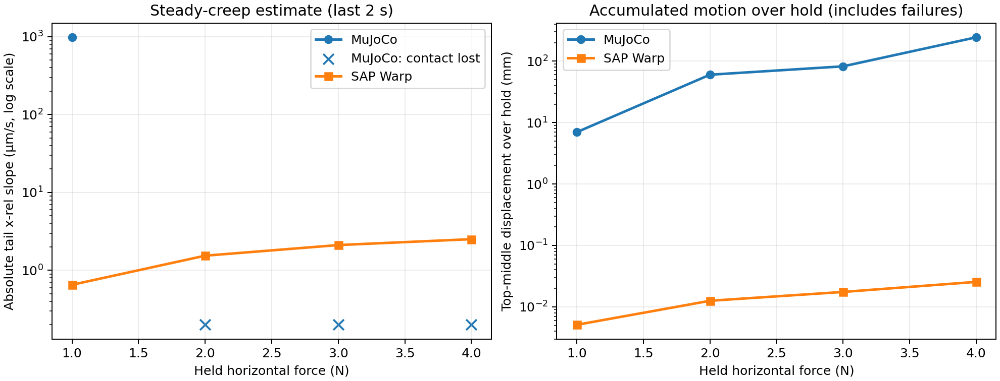
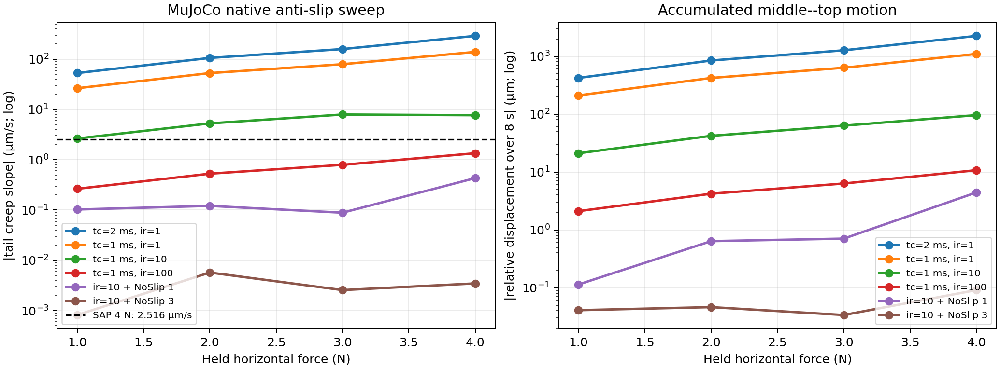

# 三层 Box 摩擦 Ramp：先验证 Normal Stability，再比较 Friction（v3）

## 结论先行

这次重做把因果关系分成两个阶段：

1. SAP 先在无水平力条件下扫 `k_pair = 1e4, 1e5, 1e6 N/m`；
2. 只有通过 normal-stability gate 的案例才进入 friction ramp；
3. MuJoCo 再针对通过案例匹配四点界面的 normal compliance，并使用相同摩擦系数。

结果是：

- SAP 只有 `k_pair = 1e4 N/m` 通过 normal gate；`1e5` 和 `1e6` 都有明显 contact switching 和竖直 chatter。
- 在稳定的 `1e4 N/m` 案例中，SAP 之前“极小水平力就大幅滑移”的现象消失了。因此旧 `1e6 N/m` 结果主要受 normal-contact instability 污染，不能单独归因于 friction regularization。
- 在 matched-normal-compliance ramp 中，top interface 的宏观持续滑动代理值为：MuJoCo `3.940 N`，SAP `4.528 N`，理想静态 Coulomb 值为 `4.905 N`。
- 在本配置下，SAP 的 breakaway 更接近理想值，而且 ramp 期间的 pre-slip displacement 更小。
- 补充的 constant-force hold 已确认：SAP 在 4 N、`rho≈0.83` 时存在约 `2.52 µm/s` 的微小 steady creep；它非零，但远小于旧不稳定案例的宏观运动。
- 进一步的 MuJoCo **native anti-slip sweep** 表明：前述 matched-compliance MuJoCo 并不是该引擎的 friction-best。保持 native stiff contact 并使用官方建议的 `elliptic + Newton + small tolerance + large impratio` 后，4 N creep 降至 `1.346 µm/s`；再加 `NoSlip=3` 后为 `0.00347 µm/s`。这两种结果都低于 SAP 的 `2.516 µm/s`，但 `NoSlip` 是专门的 friction-only post-process，不能把它误读为相同 compliant-contact model 下的通用物理准确度排名。

## 1. 公共场景

| 参数 | 数值 |
|---|---:|
| Box 数量 | 3 |
| 每个 box 尺寸 | 40 × 40 × 40 mm |
| 每个 box 质量 | 1 kg |
| 重力 | 9.81 m/s² |
| Pair friction coefficient | 0.5 |
| Timestep | 0.5 ms |
| 初始静置 | 1.5 s |
| 水平力 ramp | 0 → 8 N，持续 5 s |
| Force hold | 8 N，持续 1.5 s |

三个界面的理想静态法向载荷分别为：

| 界面 | 理想法向力 | 理想 Coulomb 上限 |
|---|---:|---:|
| Ground–bottom | 29.43 N | 14.715 N |
| Bottom–middle | 19.62 N | 9.810 N |
| Middle–top | 9.81 N | 4.905 N |

因此理想准静态条件下，middle–top 应最先滑动。

## 2. 第一阶段：SAP normal-stability gate

### 2.1 配置与判据

该阶段完全不施加水平力，仿真 3 s，并用最后 1 s 统计：

- SAP `drake` preset；
- `dt = 0.5 ms`；
- `rigid_gap = 0`，shape margin = 0；
- pair `tau = 3 ms`，所以两个相同 shape 各设 `tau = 1.5 ms`；
- pair `k` 为目标值，两个相同 shape 各设 `ke = 2 k_pair`。

一个 stiffness case 只有在全部三个界面和全部三个 box 同时满足以下条件时才通过：

| Metric | Gate |
|---|---:|
| 平均接触点数 | 至少 3.95 |
| Contact duty | 至少 99.9% |
| 平均法向力相对误差 | 不超过 1% |
| 法向力变异系数 `std/mean` | 不超过 1% |
| Gap 标准差 | 不超过 1 µm |
| 每个 box 的竖直 RMS 速度 | 不超过 0.1 mm/s |
| Truncated contacts | 必须为 0 |

这里 `C(t)` 和 contact duty 用于判断接触是否持续存在；平均 `Fn` 正确本身不够，因为间歇性大 impulse 也可能给出正确时间平均值。

### 2.2 Gate 汇总

“内部最差值”取 bottom–middle 与 middle–top 中更差的一项。

| `k_pair` | 内部最小 duty | 内部最小平均 C | 最大 Fn CV | 最大 box `vz,RMS` | 结果 |
|---:|---:|---:|---:|---:|---|
| 1e4 N/m | 100.0% | 4.000 | 0.00043% | 0.0022 mm/s | **通过** |
| 1e5 N/m | 37.5% | 1.501 | 132.3% | 6.19 mm/s | 不通过 |
| 1e6 N/m | 21.3% | 0.854 | 192.0% | 17.34 mm/s | 不通过 |

### 2.3 每个界面的完整结果

| `k_pair` | 界面 | 平均 C | Duty | 平均 Fn | Fn std | 平均 geometric gap | Gap std |
|---:|---|---:|---:|---:|---:|---:|---:|
| 1e4 | Ground–bottom | 4.000 | 100.0% | 29.430001 N | 0.000019 N | -0.735749 mm | 0.000 µm |
| 1e4 | Bottom–middle | 4.000 | 100.0% | 19.620001 N | 0.000055 N | -0.390493 mm | 0.000 µm |
| 1e4 | Middle–top | 4.000 | 100.0% | 9.810001 N | 0.000042 N | -0.145257 mm | 0.000 µm |
| 1e5 | Ground–bottom | 4.000 | 100.0% | 29.425912 N | 5.261 N | -0.073575 mm | 1.944 µm |
| 1e5 | Bottom–middle | 2.499 | 62.5% | 19.610196 N | 15.542 N | -0.000349 mm | 3.097 µm |
| 1e5 | Middle–top | 1.501 | 37.5% | 9.818576 N | 12.985 N | +0.000646 mm | 3.403 µm |
| 1e6 | Ground–bottom | 4.000 | 100.0% | 29.452117 N | 31.821 N | -0.007359 mm | 0.887 µm |
| 1e6 | Bottom–middle | 0.856 | 21.4% | 19.648443 N | 37.698 N | +0.006731 mm | 7.553 µm |
| 1e6 | Middle–top | 0.854 | 21.3% | 9.801169 N | 18.823 N | +0.009763 mm | 9.209 µm |

各 stiffness 下三个 box 的 `vz,RMS`：

| `k_pair` | Bottom | Middle | Top |
|---:|---:|---:|---:|
| 1e4 | 0.00044 mm/s | 0.00216 mm/s | 0.00031 mm/s |
| 1e5 | 4.014 mm/s | 6.188 mm/s | 4.809 mm/s |
| 1e6 | 2.440 mm/s | 17.345 mm/s | 6.655 mm/s |

### 2.4 这一阶段说明什么？

- `1e4` 是真正稳定的 normal equilibrium：四点接触持续存在，`Fn` 与位置几乎不波动。
- `1e5` 已进入过渡/不稳定区：平均支撑力仍正确，但内部 contact duty 和瞬时 `Fn` 明显恶化。
- `1e6` 的平均 `Fn` 仍接近静力值，但靠间歇性接触 impulse 维持，不能作为 friction-only benchmark 的初始状态。

因此第二阶段只使用 `k_pair = 1e4 N/m`。

## 3. 第二阶段：matched normal compliance

### 3.1 SAP 配置

| 参数 | 数值 |
|---|---:|
| Pair stiffness | 1e4 N/m |
| Shape stiffness | 2e4 N/m |
| Pair tau | 3 ms |
| Shape tau | 1.5 ms |
| Preset | `drake` |
| Rigid gap / margin | 0 / 0 |

### 3.2 MuJoCo 配置

MuJoCo 使用已经由 one-box 四点标定验证过的 direct-format mapping，并针对 ground–box 和相同质量 box–box 的不同 effective mass 分别设置：

| 接触 | Direct `solref=(stiffness, damping)` |
|---|---:|
| Ground–bottom | `(-1000, -63.2456)` |
| Bottom–middle | `(-2000, -89.4427)` |
| Middle–top | `(-2000, -89.4427)` |

其他设置：

- constant `solimp = (0.9, 0.9, 0.001, 0.5, 2)`；
- `cone = elliptic`；
- Newton solver，100 iteration budget；
- `implicitfast` integrator；
- margin = 0，gap = 0。

`elliptic` 是必要的控制变量：默认 pyramidal cone 会把一个 frictional contact 展开成多条标量约束，使之前 `condim=1` 的 normal-stiffness mapping 不再保持。使用 coupled elliptic cone 后，四点界面恢复目标 `K_interface ≈ 4 k_pair = 4e4 N/m`。

### 3.3 Ramp 开始前的 normal condition

| 引擎 | 界面 | 平均 Fn | Fn CV | 平均 C | Duty | 平均 geometric gap | Gap std |
|---|---|---:|---:|---:|---:|---:|---:|
| MuJoCo | Ground–bottom | 29.430 N | 0.116% | 4.000 | 100% | -0.735750 mm | 0.023 µm |
| MuJoCo | Bottom–middle | 19.620 N | 0.178% | 4.004 | 100% | -0.490165 mm | 0.717 µm |
| MuJoCo | Middle–top | 9.810 N | 0.215% | 4.004 | 100% | -0.245081 mm | 0.363 µm |
| SAP | Ground–bottom | 29.430 N | 0.000066% | 4.000 | 100% | -0.735749 mm | 0.000 µm |
| SAP | Bottom–middle | 19.620 N | 0.000210% | 4.000 | 100% | -0.390493 mm | 0.000 µm |
| SAP | Middle–top | 9.810 N | 0.000678% | 4.000 | 100% | -0.145257 mm | 0.000 µm |

两边都通过 normal-stability gate，并且 ground interface 的压缩一致。

SAP 两个内部界面的 geometric gap 比 `Fn/(4 k_pair)` 少约 0.1 mm；这是此前已经观测到的 solver residual 与 geometric distance offset。这里匹配的是 **incremental interface compliance**，没有为了消除此固定几何 offset 而使用不同的 load-specific stiffness。

## 4. Friction metrics

界面聚合摩擦比定义为：

$$
\rho_i(t)=\frac{\left\|\sum_j \mathbf{F}_{t,ij}(t)\right\|}
{\mu\sum_j F_{n,ij}(t)}.
$$

同时记录：

- `x_rel`：相对 ramp 开始时位置的界面切向位移；
- `v_t`：相邻刚体的相对切向速度；
- `rho`：聚合摩擦比；
- contact count 与 duty；
- 每点最大 friction ratio；
- 同 timestep 的 `Fn`、`Ft` 和 solver telemetry。

Force snapshot 使用目标力附近 `±0.01 N` 的样本均值。

### 为什么不再把 `|v_t| >= 1 mm/s` 直接叫 breakaway？

在低刚度 contact 下，ramp 本身会持续加载 tangential compliance，因此即使仍处于 sticking/pre-slip 区也可能超过 1 mm/s。该阈值在本实验中会过早触发。

报告使用更保守的“宏观持续滑动代理”：

> `|v_t| >= 10 mm/s` 连续至少 50 ms，并且这段时间界面始终存在接触。

这仍是操作性定义，不是新的物理定律；因此另外给出 5 mm displacement threshold 进行交叉检查。

## 5. Middle–top 核心结果

### 5.1 随水平力变化

| Force | MuJoCo `x_rel` | MuJoCo `|v_t|` | MuJoCo `rho` | SAP `x_rel` | SAP `|v_t|` | SAP `rho` |
|---:|---:|---:|---:|---:|---:|---:|
| 0.5 N | 0.238 mm | 1.117 mm/s | 0.101 | 0.216 mm | 0.587 mm/s | 0.102 |
| 1.0 N | 0.643 mm | 1.484 mm/s | 0.203 | 0.381 mm | 0.538 mm/s | 0.201 |
| 2.0 N | 1.812 mm | 2.266 mm/s | 0.410 | 0.712 mm | 0.662 mm/s | 0.415 |
| 3.0 N | 3.528 mm | 3.619 mm/s | 0.618 | 1.139 mm | 0.747 mm/s | 0.628 |
| 4.0 N | 7.190 mm | 24.558 mm/s | 0.743 | 1.587 mm | 0.737 mm/s | 0.830 |
| 4.5 N | 82.248 mm | 63.620 mm/s | 无接触 | 2.069 mm | 7.750 mm/s | 0.908 |
| 4.9 N | 201.827 mm | 540.764 mm/s | 无接触 | 13.384 mm | 104.719 mm/s | 0.878 |

解释：

- 在 `rho ≈ 0.1–0.6` 的 sub-Coulomb 区域，两边都有有限 pre-slip displacement；SAP 的位移和速度通常更小。
- MuJoCo 在约 4 N 已进入快速运动，并随后从支撑面脱离。
- SAP 到 4.5 N 仍保持接触，随后在接近理论 4.905 N 的区域快速滑动。
- SAP 滑动期间接触点可从 4 变为 5，但 contact duty 仍为 100%；这与旧 `1e6` 案例的 on/off contact switching 不同。

### 5.2 位移阈值

| Middle–top threshold | MuJoCo force | SAP force |
|---:|---:|---:|
| 0.1 mm | 0.291 N | 0.203 N |
| 1 mm | 1.354 N | 2.677 N |
| 5 mm | 3.528 N | 4.712 N |

0.1 mm 对 contact softness 很敏感，不能作为 breakaway。5 mm threshold 对应明确宏观运动，SAP 的 `4.712 N` 距理想值只差约 3.9%。

### 5.3 宏观持续滑动代理

| 引擎 | 首次持续滑动力 | 当时 `x_rel` | 当时 `rho` | Contact duty（50 ms） | 相对 4.905 N 误差 |
|---|---:|---:|---:|---:|---:|
| MuJoCo | 3.940 N | 6.492 mm | 0.751 | 100% | -19.7% |
| SAP | 4.528 N | 2.224 mm | 0.907 | 100% | -7.7% |

在这个 **稳定 normal contact + matched incremental normal compliance + 相同 `mu`** 的具体配置下，SAP 比本次 MuJoCo 配置更接近理想 Coulomb breakaway，并且在 breakaway 前保持了更小的相对位移。

## 6. 因果结论

本次实验支持以下结论：

1. **Normal stiffness 是旧 SAP friction 结果的主要混杂变量。** `k_pair = 1e6 N/m` 时，水平力开始前内部 contact duty 已只有约 21%，所以早期大位移不能解释成纯 friction behavior。
2. **降低到稳定的 `1e4 N/m` 后，SAP 的 pathological early runaway 消失。** 因而旧结果中的主要异常确实来自 `normal stiffness → contact instability` 的链条。
3. **SAP 仍有 sub-Coulomb pre-slip motion；后续 constant-force hold 已确认它包含很小但可测的 steady creep。** 最干净的 4 N case 为约 2.52 µm/s。
4. **在当前 matched-normal-compliance ramp 中，SAP 的摩擦表现优于测试的 MuJoCo 配置。** 这体现在更小的 pre-slip drift，以及更接近 4.905 N 的宏观滑动 onset。
5. **这不是一般性的 engine ranking。** 结论限定于三层 box、`dt=0.5 ms`、`mu=0.5`、SAP `drake`、MuJoCo Newton + implicitfast + elliptic cone，以及当前 normal-compliance calibration。

## 7. Sub-Coulomb constant-force hold

### 7.1 实验方法

每个 engine 分别独立运行 `F = 1, 2, 3, 4 N`：

1. 无水平力静置 1.5 s；
2. 用 1 s 从 0 缓慢 ramp 到目标力；
3. 恒力 hold 8 s；
4. 用最后 2 s 的 `x_rel(t)` 做线性拟合。

稳态 creep estimator 为：

$$
v_{creep}=\operatorname{slope}_{OLS}\left(x_{rel}(t)\right),
\qquad t\in[8.5,10.5]\;s.
$$

同时用逐帧相对速度均值、标准差以及拟合的 `R²` 交叉验证。只有 tail contact duty 至少为 99% 时才报告 creep；接触已经丢失的案例只报告失效时间。

物理 timestep 仍为 0.5 ms。为了减少 GPU→CPU 同步开销，telemetry 每 5 ms 保存一次；这只改变记录频率，不改变求解 timestep。

### 7.2 Middle–top 结果

| 引擎 | 恒力 | Tail slope | 拟合 R² | Tail 直接 `v_t` mean ± std | 8 s 累计位移 | Tail `rho` | Tail duty / C | 结果 |
|---|---:|---:|---:|---:|---:|---:|---:|---|
| MuJoCo | 1 N | 984.63 µm/s | 0.99981 | 985.17 ± 30.38 µm/s | 6.977 mm | 0.205 | 100% / 4.00 | 明显 steady creep |
| MuJoCo | 2 N | — | — | — | 60.116 mm | — | 0% / 0 | 6.760 s 丢失接触 |
| MuJoCo | 3 N | — | — | — | 82.298 mm | — | 0% / 0 | 4.110 s 丢失接触 |
| MuJoCo | 4 N | — | — | — | 244.347 mm | — | 0% / 0 | 3.105 s 丢失接触 |
| SAP | 1 N | 0.653 µm/s | 0.436 | -4.79 ± 527.27 µm/s | 5.101 µm | 0.199 | 100% / 4.00 | 漂移低于 jitter，不能可靠分离 |
| SAP | 2 N | 1.544 µm/s | 0.976 | 2.06 ± 195.84 µm/s | 12.544 µm | 0.413 | 100% / 4.31 | 很小漂移，伴随 normal jitter |
| SAP | 3 N | 2.113 µm/s | 0.941 | 3.31 ± 152.35 µm/s | 17.477 µm | 0.622 | 100% / 4.80 | 很小漂移，伴随 normal jitter |
| SAP | 4 N | **2.516 µm/s** | **0.99998** | **2.530 ± 0.237 µm/s** | **25.491 µm** | **0.830** | **100% / 5.00** | 清晰、稳定的微小 steady creep |

### 7.3 Normal stability during hold

SAP 的 1–3 N case 没有丢失接触，但仍存在不同程度的竖直/法向力 jitter，因此其微米级 slope 需要谨慎解释：

| SAP force | 最大 body `vz,RMS` | 最大 interface Fn CV | 最大 gap std | 严格 normal gate |
|---:|---:|---:|---:|---|
| 1 N | 0.868 mm/s | 11.06% | 0.880 µm | 不通过 |
| 2 N | 0.514 mm/s | 11.33% | 0.569 µm | 不通过 |
| 3 N | 0.402 mm/s | 8.97% | 0.583 µm | 不通过 |
| 4 N | **0.0061 mm/s** | **0.0026%** | **0.059 µm** | **通过** |

4 N 是最强的证据：它低于理想 4.905 N Coulomb limit，tail contact manifold 持续存在，法向力、gap 和竖直速度均稳定；同时 `x_rel` 呈高度线性的 2.516 µm/s 漂移。因此可以得出：

> SAP `drake` 在该稳定配置下并非严格的零速 static Coulomb lock；它存在可测的 sub-Coulomb regularized creep，但量级只有数 µm/s。

这与旧 `k_pair=1e6` 的宏观 runaway 完全不是同一量级。4 N hold 8 s 的累计相对位移只有 25.5 µm，约为 40 mm box 宽度的 0.064%。

MuJoCo 结果只适用于当前 matched-compliance、constant-solimp、elliptic-cone 配置。其 1 N creep 约为 SAP 4 N case 的 391 倍；2–4 N 则发生几何接触丢失。但这不能推广为所有 MuJoCo 配置，特别是不能代表更硬的 native contact 或 MuJoCo 的 anti-slip controls；该 native comparison 已在下一节单独补齐。

至此，当前三层 box friction 组已经完成：normal gate、matched-compliance ramp 和 sub-Coulomb hold 三部分形成闭环。

## 8. MuJoCo native-best friction sweep

### 8.1 为什么需要这一轮？

第 7 节的 MuJoCo 为了匹配 SAP `k_pair=1e4 N/m` 的 normal compliance，特意设置了较软的、按界面区分的 direct `solref`。这对于“**相同 normal compliance** 下的 formulation comparison”是正确控制变量，但不代表 MuJoCo 在其本机 contact model 下对静摩擦的最佳表现。

因此本轮保持相同三层 box、`mu=0.5`、`dt=0.5 ms`、1.5 s settle、1 s force ramp、8 s hold，以及相同的 middle–top telemetry；只改为 MuJoCo native geom contact：

- `margin=0`、`gap=0`；
- positive-format `solref=(timeconst, 1)`，默认 position-dependent `solimp=(0.9,0.95,0.001,0.5,2)`；
- `cone=elliptic`、Newton、`tolerance=1e-12`、`implicitfast`；
- `timeconst=1 ms` 是 `dt` 的两倍，即 MuJoCo refsafe 允许的最硬 positive-format setting；另保留 `2 ms` 基线；
- 分别扫 `impratio=1,10,100`，并在 `impratio=10` 上扫 `noslip_iterations=1,3`。

这正是 MuJoCo 文档给出的 slow-slip 抑制顺序：elliptic cone、增大 `impratio`、Newton + 小 tolerance；仍不足时再开 NoSlip。NoSlip 是在主 solver 后执行、只更新 friction force 的 modified-PGS post-process，它刻意忽略 friction regularization 来抑制 drift。因此它是“MuJoCo 可实现的 anti-slip 模式”，而不是和 SAP compliant friction 完全同一模型的参数重标定。详见 [MuJoCo Modeling: solver / slow slippage](https://mujoco.readthedocs.io/en/latest/modeling.html) 与 [XML reference: `noslip_iterations`](https://mujoco.readthedocs.io/en/latest/XMLreference.html)。

### 8.2 配置和代价

| Name | `timeconst` | `impratio` | NoSlip iterations | 10.5 s simulation wall time (mean) |
|---|---:|---:|---:|---:|
| Native baseline | 2 ms | 1 | 0 | 0.477 s |
| Stiffer native | 1 ms | 1 | 0 | 0.459 s |
| `impratio_10` | 1 ms | 10 | 0 | 0.486 s |
| `impratio_100` | 1 ms | 100 | 0 | 0.466 s |
| `noslip_1` | 1 ms | 10 | 1 | 0.774 s |
| `noslip_3` | 1 ms | 10 | 3 | 0.979 s |

`NoSlip=3` 大约是无 NoSlip native run 的 2.1 倍 wall time，但仍不到每次 1 s；这是小型 CPU 模型，不能外推到大接触系统。

### 8.3 全部 constant-force hold 结果（middle–top）

`v_creep` 是最后 2 s 中 `x_rel(t)` 的 OLS slope；括号是 8 s hold 的累计相对位移。所有 slope 均为正，只有 `noslip_1, 4 N` 因 post-process 的微小反向修正为负，因此下表给绝对值以便比较尺度。

| Configuration | 1 N | 2 N | 3 N | 4 N |
|---|---:|---:|---:|---:|
| Native 2 ms, `ir=1` | 52.869 µm/s (422.94 µm) | 105.750 (845.97) | 158.644 (1269.08) | 289.745 (2250.72) |
| Native 1 ms, `ir=1` | 26.400 (211.20) | 52.801 (422.41) | 79.203 (633.63) | 139.296 (1098.74) |
| 1 ms, `ir=10` | 2.640 (21.12) | 5.280 (42.24) | 7.920 (63.37) | 7.669 (96.23) |
| 1 ms, `ir=100` | 0.264 (2.11) | 0.528 (4.23) | 0.792 (6.34) | **1.346 (10.77)** |
| 1 ms, `ir=10`, NoSlip=1 | 0.103 (0.11, reverse) | 0.121 (0.64) | 0.089 (0.71) | 0.431 (4.45, reverse) |
| 1 ms, `ir=10`, NoSlip=3 | **0.000819 (0.041, reverse)** | **0.005722 (0.046)** | **0.002564 (0.034, reverse)** | **0.003474 (0.092)** |

趋势非常清楚：

1. 在 `ir=1` 下，`timeconst` 从 2 ms 降到 1 ms，creep 大约减半；这仍然保留了 MuJoCo soft friction 的显著 steady sliding。
2. 只把 `impratio` 从 1 提至 10，就再降低约 10 倍；到 100 又约降低 10 倍。以 1–3 N 为例，`v_creep` 近似按 `1/impratio` 缩放。
3. `NoSlip=1` 进一步把 creep 推至约 `0.1 µm/s`。`NoSlip=3` 在所有 four sub-Coulomb loads 下达到 `0.0008–0.0057 µm/s`；这说明它确实在抑制 soft-contact friction drift，而不是仅改变 onset force。

### 8.4 4 N：与 SAP 的干净对照

4 N 是 SAP 中唯一同时满足严格 normal gate 且有高质量线性 creep fit 的 hold case，因此用它作主对照。理想静摩擦上限为 `4.905 N`，所以此处 `rho≈0.816 < 1`。

| Engine / configuration | Tail creep slope | Tail direct `v_t` | 8 s displacement | `Fn` / CV | `rho` | Duty / mean C | Max body `vz,RMS` |
|---|---:|---:|---:|---:|---:|---:|---:|
| SAP `k_pair=1e4` | 2.516 µm/s | 2.530 ± 0.237 µm/s | 25.491 µm | 9.810 N / 0.0026% | 0.830 | 100% / 5.00 | 0.0061 mm/s |
| MuJoCo native 1 ms, `ir=1` | 139.296 µm/s | 139.296 ± 0.389 µm/s | 1098.742 µm | 9.810 N / 0.00003% | 0.816 | 100% / 4.00 | 0.000015 mm/s |
| MuJoCo 1 ms, `ir=10` | 7.669 µm/s | 7.638 ± 1.996 µm/s | 96.226 µm | 9.810 N / 0.0725% | 0.816 | 100% / 5.97 | 0.00221 mm/s |
| MuJoCo 1 ms, `ir=100` | **1.346 µm/s** | **1.346 ± 0.000036 µm/s** | **10.771 µm** | 9.810 N / 0.00000022% | 0.816 | 100% / 4.00 | 0.00000014 mm/s |
| MuJoCo 1 ms, `ir=10`, NoSlip=3 | **0.003474 µm/s** | **0.003473 ± 0.000020 µm/s** | **0.092 µm** | 9.810 N / 0.000000058% | 0.816 | 100% / 6.00 | 0.000000016 mm/s |

关键的排除项也都成立：native MuJoCo runs 在 tail 的 contact duty 均为 100%，`Fn` 维持约 9.81 N，且 `rho` 随力依次为 `0.204 / 0.408 / 0.612 / 0.816`，与静力预期 `F/(0.5×9.81)` 一致。所以 reduced creep 不是由 contact loss、normal-force collapse 或改变摩擦系数造成的。

### 8.5 正确的更新结论

本 benchmark 现在应拆成两个都成立、但不能混在一起的结论：

1. **Matched compliant formulation：** 在第 3 节的 matching 下，SAP 比该 soft MuJoCo setting 更接近理想 breakaway，且 SAP 4 N creep 为仅 `2.516 µm/s`；这仍是有效的受控比较。
2. **Engine-native anti-slip capability：** MuJoCo 并不局限于这个 soft setting。不开 NoSlip、仅使用 native stiff contact + `impratio=100` 时，4 N creep 已为 `1.346 µm/s`，低于 SAP 的 `2.516 µm/s`。开 NoSlip=3 后降至 `0.003474 µm/s`，比 SAP 4 N 低约 724 倍。
3. **不能据此宣布“MuJoCo 物理一定更准确”。** `impratio` 改变 friction-versus-normal constraint hardness；NoSlip 更是取消其更新摩擦维度的 regularizer 的后处理。它非常适合需要近似零 drift 的仿真/控制任务，但会增加计算成本、使 inverse dynamics ill-defined，并在复杂多接触中可能不稳定。要判断物理 fidelity，仍需实验或独立 ground truth，而不是只比这一条 zero-slip 指标。

因此用户最初的假设得到支持：SAP 在 matched compliant setting 中确实更自然地维持 sticking；但 MuJoCo 通过其 native anti-slip tuning 可以达到相同甚至更低的残余滑移。这个任务不能再用来声称 SAP 对 static friction 有无条件优势。

## 9. Runtime

| Run | Device | Simulated time | Wall time |
|---|---|---:|---:|
| SAP normal gate，1e4 | RTX 3090 | 3 s | 34.04 s |
| SAP normal gate，1e5 | RTX 3090 | 3 s | 30.82 s |
| SAP normal gate，1e6 | RTX 3090 | 3 s | 52.18 s |
| SAP friction ramp，1e4 | RTX 3090 | 8 s | 100.70 s |
| MuJoCo matched friction ramp | CPU | 8 s | 1.12 s |
| SAP force hold，1 N | RTX 3090 | 10.5 s | 101.29 s |
| SAP force hold，2 N | RTX 3090 | 10.5 s | 117.42 s |
| SAP force hold，3 N | RTX 3090 | 10.5 s | 132.47 s |
| SAP force hold，4 N | RTX 3090 | 10.5 s | 109.01 s |
| MuJoCo force hold，1/2/3/4 N | CPU | 每次 10.5 s | 0.42 / 0.40 / 0.38 / 0.38 s |
| MuJoCo native holds，NoSlip=0 | CPU | 每次 10.5 s | 0.46–0.49 s |
| MuJoCo native holds，NoSlip=3 | CPU | 每次 10.5 s | 0.75–1.18 s |

SAP 脚本逐 timestep 将 contact telemetry 从 GPU 同步到 CPU，因此这里的 wall time 不是 pure stepping throughput。

## 10. 可复现文件

- SAP normal gate runner：`sap-sim/scripts/run_frictional_stack_normal_gate.py`
- SAP parameterized friction runner：`sap-sim/scripts/run_frictional_stack_ramp_v2.py`
- MuJoCo matched runner：`mujoco-sim/learn_mujoco/stacking_experiments/run_frictional_stack_ramp_matched.py`
- v3 summary script：`scripts/summarize_frictional_stack_v3.py`
- SAP constant-force runner：`sap-sim/scripts/run_frictional_stack_force_holds_v3.py`
- MuJoCo constant-force runner：`mujoco-sim/learn_mujoco/stacking_experiments/run_frictional_stack_force_holds_v3.py`
- Constant-force summary/plot script：`scripts/summarize_frictional_stack_force_holds_v3.py`
- MuJoCo native anti-slip runner：`mujoco-sim/learn_mujoco/stacking_experiments/run_frictional_stack_force_holds_native.py`
- MuJoCo native anti-slip summary/plot script：`scripts/summarize_frictional_stack_force_holds_native.py`
- Native telemetry and machine-readable summary：`exp-results/frictional-stack-v3/force-holds/mujoco-native/`
- Fixed-normal MuJoCo anti-slip ablation report：`exp-report/mujoco-anti-slip-ablation.md`
- Fixed-normal anti-slip runner / summary：`mujoco-sim/learn_mujoco/stacking_experiments/run_frictional_stack_anti_slip_ablation.py`、`scripts/summarize_mujoco_anti_slip_ablation.py`
- 完整机器可读汇总：`exp-results/frictional-stack-v3/summary.json`
- Constant-force 完整汇总：`exp-results/frictional-stack-v3/force-holds/summary.json`
- Constant-force 核心表：`exp-results/frictional-stack-v3/force-holds/top-interface-summary.csv`
- Constant-force 图：`exp-results/frictional-stack-v3/force-holds/steady-creep-comparison.png`
- SAP gate traces：`exp-results/frictional-stack-v3/sap-normal-gate/`
- SAP stable friction trace：`exp-results/frictional-stack-v3/sap-friction-kpair-1e4/trace.csv`
- MuJoCo matched trace：`exp-results/frictional-stack-v3/mujoco-matched-kpair-1e4/trace.csv`
- 旧 v2、未通过 normal gate 的对比仍保留在：`exp-results/frictional-stack-v2/`
