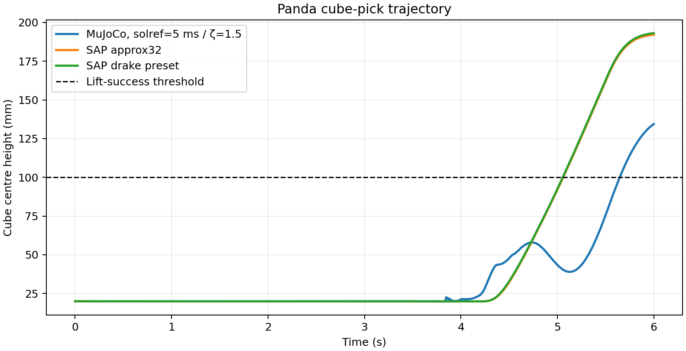
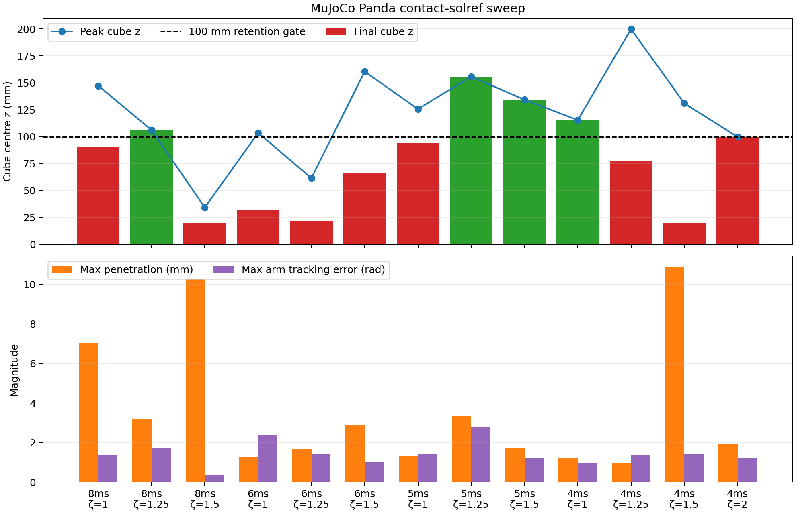
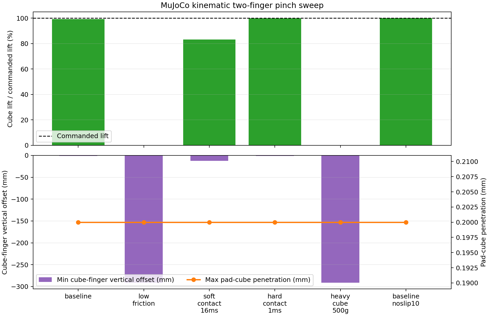

# Panda Pick 与 Two-Finger Pinch Grasp：已有实验的完整整理

## 结论先行

这两组实验回答的是不同层级的问题，不能合成一个简单的 “SAP vs MuJoCo 谁更好” 排名。

1. **Panda pick** 是最接近机器人任务的试验：同一 Panda URDF、40 mm cube、`mu=0.8`、同一 0–6 s pick-and-lift reference，以及相同 nominal arm/finger PD intent。SAP 两个 tested preset 都稳定完成 lift prefix；经 `solref` sweep 后，MuJoCo 也可稳定完成 lift，但最终高度和 penetration / tracking trade-off 更依赖参数。
2. **Pinch grasp** 是一个刻意简化的摩擦传力 diagnostic：两个平行 pad 预压 40 mm cube 后上抬。它清晰显示低摩擦、较软接触和较大负载会造成失抓；MuJoCo NoSlip 可减少残余 slip。它不是完整机器人 controller benchmark。
3. SAP 的 simple pinch 和 staged-ramp 结果都命中 `max_rigid_contact=512`。尤其 staged-ramp 有约 10.3 mm penetration 且 low-friction 几乎不改变 lift，因此该子实验目前只能当作 collision/contact-capacity diagnostic，**不能**作可靠的 SAP friction ranking。

---

# Part I — Panda cube pick

## 1. 任务定义与对齐范围

| 项目 | 设定 |
|---|---|
| Robot | Franka FR3 Panda + hand，来自同一 source URDF |
| Object | 40 × 40 × 40 mm cube，质量 96 g |
| 初始 cube centre | `[0.35, -0.15, 0.02] m` |
| Ground / gravity | 平面 ground，gravity enabled |
| Friction | 所有几何标量 `mu=0.8` |
| Self collision | 两边均关闭 robot–robot self collision；保留 robot–cube、cube–ground |
| Reference | 同一 JSON keyframes；0–6 s 只覆盖 approach → close → lift prefix，尚未覆盖 release / place |
| Arm controller intent | `Kp/Kd=100/20` |
| Finger controller intent | `Kp/Kd=3000/80` |
| Lift-success gate | cube centre final `z>0.10 m`；这是操作性 retention gate，不是物理 ground truth |

动作时序为：`0–3.8 s` approach / descend，`3.8–4.2 s` close / hold，`4.2–6.0 s` lift。完整 reference 原本到 8.6 s，但当前 trial 在 6 s 截止，因此所有 “success” 都是 **pickup-and-lift success**，不是完整 pick-and-place 成功率。

### 对齐并非完全 engine-only 的原因

SAP 使用实际 Drake `InverseDynamicsController` 来产生 common torque；MuJoCo 使用自身 inverse dynamics + 同一 PD gain intent，并按 URDF effort limits clip torque。两者 dt 也不同：SAP 5 ms、MuJoCo 1 ms。SAP CPU collision pipeline 对 mesh–mesh 的支持有限，而 external Drake 使用转换后的 convex-hull collision meshes。

因此实验应解释为：

> **matched task + approximately matched control intent 下的 end-to-end contact/control behavior**，而不是严格逐 timestep、逐接触 law 等价的 engine benchmark。

## 2. 主要结果

| Engine / setting | dt | Final cube z | Peak z | Lift gate | Max penetration | 备注 |
|---|---:|---:|---:|---|---:|---|
| SAP `approx32` | 5 ms | 192.151 mm | 192.151 mm | pass | 2.260 mm | friction utilization 达到 1 |
| SAP `drake` preset | 5 ms | **193.107 mm** | **193.107 mm** | pass | **0.286 mm** | tested SAP 中 penetration 最低 |
| External Drake reference | 5 ms | 191.549 mm | 191.549 mm | pass | — | contact telemetry 未记录 |
| MuJoCo, tuned `solref=(5 ms,1.5)` | 1 ms | 134.398 mm | 134.398 mm | pass | 1.700 mm | 当前 MuJoCo best-balanced rerun |
| MuJoCo, early default `solref=(20 ms,1)` | 1 ms | 19.94 mm | 22.44 mm | fail | 11.60 mm | 稳定数值运行，但未形成稳定 grasp |

图中可以看到，SAP 两个 preset 在 4.3 s 后平滑抬升，在 6 s 到约 192–193 mm。MuJoCo tuned case 会在闭合 / 抬升早期出现明显高度波动（约 43–58 mm），但最终仍将 cube 留在 134.4 mm，越过 100 mm retention gate。

这说明原始结论不应写成 “MuJoCo 不能 pick”。更准确的是：

- 默认较软 `solref=20 ms` 的 MuJoCo adapter 未能抓起 cube；
- 经过 contact tuning 后，MuJoCo 可以完成当前 lift prefix；
- 在**各自已测试配置**下，SAP 达到更高 final z，且 `drake` preset 的 penetration 更低；
- 但 controller path、timestep 和 collision representations 并非完全相同，不能从此推出一般性 engine physics ranking。

## 3. MuJoCo contact stiffness / damping sweep

固定场景、轨迹、controller、friction 和 timestep，仅扫描 positive-format `solref=(timeconst,dampratio)`。所有 13 个 case 都没有数值发散；但只有 4 个在 6 s 仍满足 grasp-retention gate。

| `timeconst` | `dampratio` | Final z | Peak z | Final retention | Max penetration | Max arm tracking error |
|---:|---:|---:|---:|---|---:|---:|
| 8 ms | 1.00 | 90.294 mm | 147.368 mm | fail | 7.021 mm | 1.370 rad |
| 8 ms | 1.25 | **106.174 mm** | 106.174 mm | pass | 3.170 mm | 1.710 rad |
| 8 ms | 1.50 | 19.979 mm | 34.185 mm | fail | 10.248 mm | 0.368 rad |
| 6 ms | 1.00 | 31.402 mm | 103.579 mm | fail | 1.289 mm | 2.406 rad |
| 6 ms | 1.25 | 21.600 mm | 61.554 mm | fail | 1.681 mm | 1.431 rad |
| 6 ms | 1.50 | 65.793 mm | 160.515 mm | fail | 2.871 mm | 1.004 rad |
| 5 ms | 1.00 | 93.773 mm | 125.747 mm | fail | 1.342 mm | 1.430 rad |
| 5 ms | 1.25 | **155.413 mm** | 155.813 mm | pass | 3.342 mm | **2.790 rad** |
| 5 ms | 1.50 | **134.398 mm** | 134.398 mm | pass | 1.700 mm | 1.197 rad |
| 4 ms | 1.00 | **115.013 mm** | 115.403 mm | pass | **1.213 mm** | **0.976 rad** |
| 4 ms | 1.25 | 77.962 mm | 200.063 mm | fail | **0.953 mm** | 1.375 rad |
| 4 ms | 1.50 | 19.992 mm | 130.995 mm | fail | 10.879 mm | 1.432 rad |
| 4 ms | 2.00 | 99.773 mm | 99.773 mm | fail | 1.916 mm | 1.243 rad |

### Sweep 的可靠发现

- 参数效果是强烈**非单调**的；只说 “timeconst 更小更好” 或 “damping 更高更稳定” 都不成立。
- `5 ms,1.25` 给最高 final height（155.4 mm），但 arm tracking error 最大（2.79 rad），同时 penetration 较高（3.34 mm）。它是 lift-height winner，不是无条件最佳。
- `5 ms,1.5` 是当前平衡选择：134.4 mm final height、1.70 mm penetration、1.20 rad max arm error。
- `4 ms,1.0` 是低 penetration / 低 controller disturbance 的保守选择：115.0 mm、1.21 mm、0.98 rad，但 lift margin 较小。
- Peak height 不等于 grasp retention。例如 `4 ms,1.25` peak 到 200.1 mm，却在 6 s 只剩 78.0 mm，表示瞬时抓起后滑落。

该 sweep 的价值在于定义了 adapter 的 feasible parameter window；尚不足以将 `solref` 数字解释为已校准的真实材料 stiffness。

## 4. Panda 目前能与不能说明什么

**能够说明：** 同一 scripted lift 下，contact/controller coupling 足以改变 “未抓起、短暂抓起、6 s retention” 三类 outcome；SAP tested preset 对此轨迹较稳健，MuJoCo 需要针对任务调 contact response。

**不能说明：** SAP 在真实 Panda manipulation 中一定更准确；或 MuJoCo 的 solver 本身不能 grasp。还缺少 controller-equivalence verification、contact mesh / collision pair audit、真实抓取力与指尖相对 slip telemetry、多个 pose / mass / friction seeds。

---

# Part II — Two-finger pinch grasp

## 5. 简化任务定义

这是对持续静摩擦传力的刻意简化：两个 20 × 80 × 80 mm pad 从两侧夹住 40 mm cube，初始每侧压缩 0.2 mm，随后共同竖直上抬 60 mm。cube 离开 table 后，重力完全由两侧 pad 的切向静摩擦承担。

MuJoCo pinch sweep 使用：

| 项目 | 设定 |
|---|---:|
| Cube | 40 mm，baseline mass 100 g |
| Finger force controller | position / velocity gains `20000 / 300` |
| dt / duration | 0.5 ms / 4 s |
| Lift | 0.5–3.0 s linear 60 mm |
| Baseline friction | 0.20 |
| Baseline contact | `solref=(4 ms,1)`，`solimp=(0.95,0.99,0.001,0.5,2)` |
| Cone / solver | elliptic / Newton + implicitfast |

这是 kinematic/PD finger fixture，而不是 Panda hand；它特别适合观察 friction/load/contact-softness sensitivity，但不代表完整 manipulation policy。

## 6. MuJoCo pinch parameter sweep

| Case | `mu` | Cube mass | Contact `solref` | NoSlip | Cube lift | Follow | Leaves table | Max penetration | 结果 |
|---|---:|---:|---:|---:|---:|---:|---|---:|---|
| Baseline | 0.20 | 100 g | 4 ms | 0 | 59.507 mm | 99.18% | yes | 0.200 mm | 成功 |
| Low friction | 0.05 | 100 g | 4 ms | 0 | 0 mm | 0% | no | 0.200 mm | 掉回 table |
| Soft contact | 0.20 | 100 g | 16 ms | 0 | 49.904 mm | 83.17% | yes | 0.200 mm | 明显 lag / slip |
| Hard contact | 0.20 | 100 g | 1 ms | 0 | 59.877 mm | 99.79% | yes | 0.200 mm | 成功 |
| Heavy cube | 0.20 | 500 g | 4 ms | 0 | 0 mm | 0% | no | 0.200 mm | 掉回 table |
| Baseline + NoSlip | 0.20 | 100 g | 4 ms | 10 | 59.998 mm | 100.00% | yes | 0.200 mm | 近零残余 slip |

### 这个结果表示什么？

- `mu=0.20, 100 g` 成功而 `mu=0.05` 失败：夹持是否成功确实受 friction capacity 限制，而不是单纯 finger trajectory 把 cube “带走”。
- 100 g 成功、500 g 失败：在固定 0.2 mm preload 与 contact setting 下，grip force capacity 有明确载荷边界。
- 16 ms soft contact 仍 lift 49.9 mm，但只跟随 83.2%，显示柔顺 / regularization 会带来持续相对滑移或 grasp lag。
- 1 ms hard contact 基本恢复 100% follow；NoSlip=10 也将 4 ms baseline 从 99.18% 推至 100%。后者是 anti-drift post-process，不等价于经过真实材料校准的更强摩擦。

这个任务是目前最直观的 MuJoCo friction / softness ablation，但未记录 pad normal force、`rho=Ft/(mu Fn)`、或 cube–pad relative tangential velocity。若要成为可定量的 Coulomb benchmark，下一轮应补这些 telemetry，并用力或 compliant closure 控制 preload，而不是只指定几何 compression。

## 7. SAP pinch：simple preloaded lift

SAP `two_finger_pinch.yaml` 的 simple case 也使用 100 g、`mu=0.20`、预压夹持与 60 mm lift；shape material 为 `ke=1e4 N/m`、`tau=30 ms`、`rigid_gap=0`、Drake preset、CPU，dt=0.5 ms。

| Case | `mu` | Cube lift | Follow | Final z | Max penetration | Max contact count | 结果 |
|---|---:|---:|---:|---:|---:|---:|---|
| SAP baseline | 0.20 | 60.487 mm | 100.81% | 141.354 mm | 0.300 mm | 512 | 成功 |
| SAP low friction | 0.05 | -27.103 mm | -45.17% | 19.951 mm | 0.594 mm | 512 | 失败 / 落回 table |

定性上它与 MuJoCo simple pinch 一致：baseline 可以持续带起 cube，低摩擦则失败。这是一个有用的 cross-engine sanity check。

但需要保留两个限制：

1. SAP 的 `max_contact_count=512` 等于配置容量，表示本 run 至少在某些 step 打满了 contact buffer；必须检查是否发生 truncation，不能据此报告高精度 force 或 penetration conclusion。
2. SAP 的 shape `ke/tau` 与 MuJoCo `solref/solimp` 并非一一物理映射，finger actuation implementations 也不同。因此 60.49 mm vs 59.51 mm 之类的微小差异没有跨 engine 的物理含义。

## 8. SAP staged-ramp 与 MuJoCo ground-ramp：为什么尚不能直接比较

另有一版 staged-ramp：先移动 fingers close，再降低 support，然后 lift。这比 simple preloaded lift 更接近“从桌面抓取”，但当前数据揭示它还不是干净 benchmark。

| Engine / scene | Baseline lift | Low-friction lift | Max penetration | Contact count | 判断 |
|---|---:|---:|---:|---:|---|
| SAP staged ramp, dt=1 ms | 50.575 mm (84.29%) | 50.445 mm (84.08%) | 10.288 / 10.306 mm | 512 | low-`mu` 不敏感，且 penetration 大、capacity 饱和 |
| MuJoCo ground-ramp, dt=0.5 ms | 58.327 mm | 未扫 | 未记录 | peak 12 | baseline smoke test only |

SAP staged-ramp 的 low-friction case 几乎与 baseline 等效，正好说明场景目前没有隔离出预期的摩擦机制；同时 penetration 约 10 mm 对 40 mm cube 而言过大。MuJoCo ground-ramp 又使用不同的 close/lift timing 和 ground construction，且没有 matching low-friction run。因此这里最严谨的结论是：

> staged-ramp 暂时只证明两个 pipeline 都可运行一个“从 support 到 lift”的动作；它不能作为 SAP vs MuJoCo friction fidelity 的证据。

优先修复路径是：检查 SAP `512` capacity 是否截断、降低 /精化 contact manifold、记录每 pad `Fn/Ft/rho`、确保 support 移除后 cube 只靠双侧 friction 支撑，并在两边运行完全相同的 timing、质量、`mu` 和 telemetry。

## 9. 总体评估和下一步

| 实验 | 当前证据强度 | 适合得出的结论 | 不适合得出的结论 |
|---|---|---|---|
| Panda pick | 中等 | 对给定轨迹的 task-level robustness / parameter sensitivity | general engine accuracy ranking |
| MuJoCo simple pinch sweep | 中等偏强 | friction、mass、contact softness 与 NoSlip 的因果 sensitivity | real gripper force calibration |
| SAP simple pinch | 中等偏弱 | baseline / low-friction qualitative sanity check | precise force or penetration comparison（capacity hit） |
| Staged ramp | 弱 | current pipeline integration smoke test | friction fidelity comparison |

建议的后续优先级：

1. 给 simple pinch 的 MuJoCo 和 SAP 都补 `Fn, Ft, rho, relative slip, contact duty`，把它升级为 force-balance benchmark。
2. 先修 SAP staged-ramp 的 contact capacity / large-penetration 问题，再讨论与 MuJoCo ground-ramp 的 matched test。
3. Panda task 增加真实 finger–cube slip、grip normal force、arm tracking RMS、torque saturation ratio，并将 6 s lift prefix 延长至 release / placement。
4. 对 Panda 采用同一 controller implementation / torque trace replay 或明确 controller difference；再扩展 initial pose、mass、friction 的 multi-seed sweep。

## 10. Reproducibility 和原始产物

- Panda MuJoCo runner: `mujoco-sim/learn_mujoco/panda_pick_experiments/run_panda_pick.py`
- Panda MuJoCo `solref` sweep: `mujoco-sim/learn_mujoco/panda_pick_experiments/sweep_contact_stiffness.py`
- Panda SAP common-controller runner: `sap-sim/scripts/run_panda_pick_common_torque.py`
- MuJoCo pinch sweep: `mujoco-sim/learn_mujoco/pinch_grasp_experiments/pinch_grasp_sweep.py`
- MuJoCo ground-ramp: `mujoco-sim/learn_mujoco/pinch_grasp_experiments/run_ground_ramp.py`
- SAP pinch scenes/runners: `sap-sim/assets/yaml/two_finger_pinch*.yaml`、`sap-sim/scripts/run_two_finger_pinch_sap.py`
- This report’s figure generator: `scripts/summarize_panda_and_pinch.py`
- Existing videos: `exp-results/panda-pick/mujoco/panda-pick.mp4`、`exp-results/panda-pick/sap/*.mp4`、`exp-results/pinch-grasp/mujoco/videos/*.mp4`

---

# Status revision and controlled-v2 plan

This section supersedes the priority implied by the older pinch/ramp results.

## Evidence-status revision

| Task | Keep / redo | Permitted conclusion now | Prohibited conclusion now |
|---|---|---|---|
| Panda lift prefix | Keep; do not redo its base version | Task-level robustness and contact-parameter sensitivity under the existing controller paths | Strict engine-only physics ranking |
| Simple pinch | Redo as controlled v2 | The old MuJoCo ablation remains a useful qualitative causal signal | Per-pad force balance or a precise SAP-vs-MuJoCo friction comparison |
| SAP staged-ramp | Retire current version; redesign before reuse | Pipeline smoke test only | Any friction-fidelity or penetration conclusion |

The Panda result remains useful because it already establishes a scoped task-level finding: the two SAP presets complete the lift prefix; the early soft MuJoCo setting fails; tuned MuJoCo settings can also retain the cube. The controller implementation, timestep, and collision representation differences documented above remain unresolved, so a base rerun would not by itself turn this into an engine benchmark.

## Simple-pinch v2 specification

The v2 benchmark will treat the task as the manipulation extension of the existing plane-friction experiments:

\[
\text{plane kinetic/static friction}
\;\rightarrow\;
\text{two-sided pinch friction}
\;\rightarrow\;
\text{Panda grasp}.
\]

Each run must have two phases:

1. **Normal gate.** With the pads commanded to their preload state, record per side contact duty, active point count, mean/standard deviation of \(F_n\), vertical cube speed, and gap/penetration. A run is not eligible for friction interpretation until this gate is stable.
2. **Lift phase.** Record, per pad and synchronously with cube motion,
   \(F_n,F_t,\rho=|F_t|/(\mu F_n),v_{\rm slip},x_{\rm slip}\), contact duty, cube height, and grasp outcome.

The preload will not be interpreted from nominal geometric compression alone. The runner will either force-control the pads or, for position-controlled preload, report the **measured** per-pad \(F_n\). The analytical capacity check is then

\[
2\mu N \ge mg,\qquad N_{\min}=\frac{mg}{2\mu},
\]

where \(N\) is the measured normal force on either symmetric pad. The intended v2 sweep is therefore organized by measured \(N\), \(\mu\), and cube mass \(m\), not merely by a nominal pad-overlap value.

## Required exclusion rules

- A SAP run that reaches its configured contact capacity or reports nonzero contact truncation is marked **invalid for force/penetration comparison**, even if its lift visually succeeds.
- A normal gate failure is reported separately from a friction-capacity failure.
- Post-stop or post-failure displacement is not used to infer kinetic friction; it is separately labeled as static/regularized creep.

## Later Panda enhancement, not a base rerun

If Panda becomes a formal task benchmark, add finger--cube relative slip; per-finger \(F_n,F_t,\rho\); torque-saturation ratio; arm tracking RMS; and a mass/friction/initial-pose sweep. The most controlled engine comparison would replay an identical torque trace, or otherwise use an identical controller implementation.
